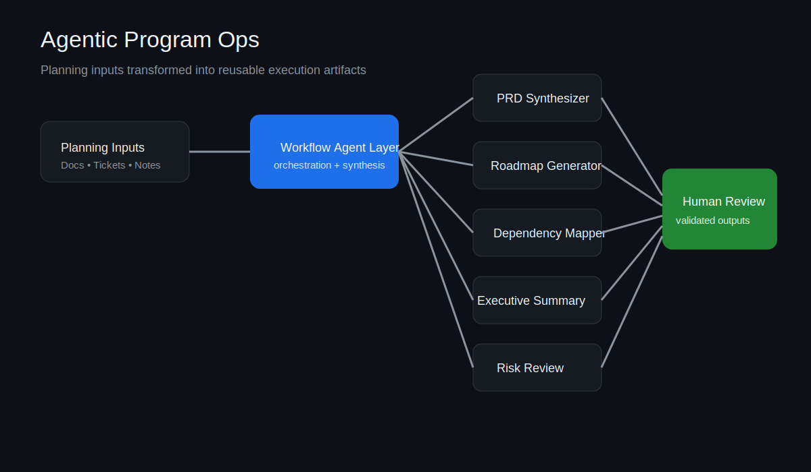

# Agentic Program Ops

AI-powered program operations system for PRDs, roadmaps, dependency mapping, executive summaries, and delivery workflows.

## Overview

Agentic Program Ops is a prototype system for AI-assisted program and product operations. It helps technical program managers, product leaders, and cross-functional teams turn fragmented planning inputs into structured PRDs, roadmap views, dependency awareness, executive summaries, and delivery signals.

This project is designed around a simple belief: teams lose time when critical planning context is scattered across docs, tickets, and stakeholder conversations. Agentic workflows can reduce that ambiguity and improve execution quality.

## What it does

- Synthesizes product and program inputs into structured PRDs
- Generates roadmap views from strategic priorities and team constraints
- Surfaces dependency risks across Jira-style workflows
- Drafts executive summaries and stakeholder updates
- Highlights delivery risks, blockers, and coordination gaps
- Demonstrates how AI can support TPM and product operations without replacing human judgment

## Visual overview



## Example artifacts

- [`examples/sample-prd-input.md`](examples/sample-prd-input.md)
- [`examples/sample-prd-output.md`](examples/sample-prd-output.md)
- [`examples/sample-exec-summary.md`](examples/sample-exec-summary.md)
- [`architecture/system-overview.md`](architecture/system-overview.md)

## Core workflows

### 1. PRD Synthesizer
Turns rough requirements, notes, and stakeholder asks into cleaner PRD drafts.

### 2. Roadmap Generator
Converts strategic goals, team capacity, and dependencies into a clearer roadmap structure.

### 3. Dependency Mapper
Pulls workstream relationships into a more understandable dependency view.

### 4. Executive Summary Generator
Creates concise updates for leadership from project and delivery signals.

### 5. Risk Review Agent
Flags coordination risks, sequencing issues, and execution ambiguity before they become delivery problems.

## Why this matters

Modern product and engineering teams are buried in fragmented planning artifacts. Program and product leaders spend too much time stitching together context instead of driving decisions.

This project explores a more scalable operating model:
- less manual summarization
- better planning clarity
- faster stakeholder alignment
- improved delivery visibility
- more leverage for technical program and product teams

## Repository structure

```text
architecture/   # system design and workflow diagrams
docs/           # product vision, decisions, and supporting notes
examples/       # sample inputs and outputs
prompts/        # prompt patterns by workflow
workflows/      # workflow definitions and agent behaviors
assets/         # screenshots and diagrams
```

## Who this is for

- Technical Program Managers
- Product Managers
- Product Operations teams
- Engineering Managers
- AI platform and workflow teams

## Status

Prototype / portfolio project

## Prototype UI

A lightweight visual prototype lives at [`prototype/index.html`](prototype/index.html). Open it locally in a browser to explore the concept UI.
