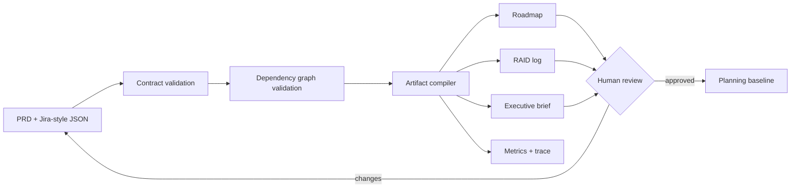

# Agentic Program Ops

**A runnable operating system that turns PRD and Jira-style inputs into an execution-ready roadmap, dependency graph, RAID log, executive brief, metrics, and trace evidence.**

[](https://github.com/christiancaviedes/agentic-program-ops/actions/workflows/ci.yml)
[](https://christiancaviedes.github.io/agentic-program-ops/)
[](https://www.python.org/)
[](LICENSE)

## The result

One realistic input produces six reviewable artifacts in milliseconds, offline, with no API key and no model cost:

```text
PRD / Jira input
      │
      ├── roadmap.md           sequencing, ownership, exit criteria
      ├── dependencies.mmd     renderable Mermaid dependency graph
      ├── raid-log.md          risks, assumptions, issues, decisions
      ├── executive-brief.md   decision-focused leadership summary
      ├── run-metrics.json     latency, completeness, cost, review state
      └── trace.jsonl          observable run event
```

The default output is explicitly marked **DRAFT — HUMAN REVIEW REQUIRED**. The system refuses unknown dependencies, duplicate IDs, and dependency cycles before creating a plausible-looking plan.

## Five-minute demo

```bash
git clone https://github.com/christiancaviedes/agentic-program-ops.git
cd agentic-program-ops
python3 -m venv .venv && source .venv/bin/activate
python -m pip install -e .

program-ops examples/launch-input.json --output build/launch-plan
```

Inspect the generated artifacts:

```bash
ls build/launch-plan
cat build/launch-plan/executive-brief.md
```

After an accountable human reviews the plan, regenerate it with an approval marker:

```bash
program-ops examples/launch-input.json --output build/approved-plan --approve
```

Try the [live workflow demo](https://christiancaviedes.github.io/agentic-program-ops/) for a visual walkthrough.

## Input contract

The CLI accepts structured JSON with program intent, target date, named decisions, risks, and Jira-style workstreams. Each workstream has an ID, owner, team, delivery window, status, exit criteria, and dependencies.

See [`examples/launch-input.json`](examples/launch-input.json) for a complete enterprise AI launch scenario.

## Quality evidence

| Control | Evidence |
|---|---|
| Input integrity | Required-field, unique-ID, reference, and cycle validation |
| Human accountability | Draft-by-default review gate; explicit `--approve` action |
| Regression protection | Unit tests across Python 3.10, 3.11, and 3.12 |
| Evaluation gate | Completeness, dependency recall, risk visibility, review-state, and cost checks |
| Observability | Per-run latency/cost metrics and JSONL trace event |
| Cost discipline | Deterministic local core; estimated model cost is $0 |
| Failure behavior | Invalid plans exit non-zero with actionable errors |
| Supply chain | No runtime dependencies; least-privilege GitHub Actions permissions |

Run the same gates as CI:

```bash
python -m unittest discover -s tests -v
python -m evals.run_evals
```

## Architecture and tradeoffs

The first release uses a deterministic compiler rather than an LLM. That is deliberate: dependency logic, risk ownership, and approval state should be testable before generative enrichment is introduced.


```mermaid
flowchart LR
  A[PRD + Jira-style JSON] --> B[Contract validation]
  B --> C[Dependency graph validation]
  C --> D[Artifact compiler]
  D --> E[Roadmap]
  D --> F[RAID log]
  D --> G[Executive brief]
  D --> H[Metrics + trace]
  E & F & G --> I{Human review}
  I -->|approved| J[Planning baseline]
  I -->|changes| A
```

**What this optimizes for:** reliable structure, inspectability, fast iteration, and a clean contract for future model-backed synthesis.

**What it does not claim:** autonomous program management, correct business judgment, or a substitute for accountable owners.

Read the [architecture](architecture/system-overview.md), [ADR](docs/adr/0001-deterministic-core.md), [threat model](docs/threat-model.md), and [sanitized production case study](docs/case-study.md).

## Failure modes and recovery

- **Missing/invalid fields:** the CLI stops before creating artifacts; correct the input and rerun.
- **Unknown dependency:** the CLI names the workstream and missing reference.
- **Dependency cycle:** the CLI rejects the plan instead of inventing an execution order.
- **Unreviewed output:** every artifact remains visibly marked as requiring human review.
- **Interrupted run:** outputs are generated from source input and can be safely regenerated in a clean directory.
- **Future model-provider failure:** the deterministic core remains the fallback path; model enrichment must never bypass validation or approval.

## Roadmap

- `v0.1`: deterministic CLI, CI, evals, trace/metrics, Pages demo, governance docs
- `v0.2`: optional provider-neutral LLM enrichment behind the validated contract
- `v0.3`: Jira/Linear adapters, diff-aware plan updates, OpenTelemetry spans
- `v1.0`: policy-controlled multi-program workspace with approval audit trail

## Why I built it

AI programs rarely fail because teams lack another summary. They fail because inputs are ambiguous, dependencies stay hidden, decisions have no owner, and generated output looks more certain than the evidence allows.

This project demonstrates the operating discipline I bring to AI platform and technical program leadership: make the contract explicit, instrument the workflow, put quality gates before launch, and keep human accountability visible.

## License

[MIT](LICENSE)
